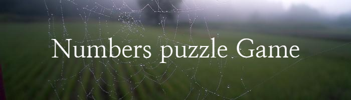

<!-- Bunner-Image -->

<!-- Badge for ide jypeter notbook -->

<!-- Short description of the project -->
## Project Description

This program is a puzzle game, you have to guess a 3-digit number based on the clues. The program offers one of the following clues depending on your answer:

* "True" when your answer contains a number in the wrong place
* "Bingo" when your answer contains a number in the right place
* "Fail" when your answer does not have a correct number.

The program offers ten tries to find the correct number

## Technology used 
1. Python 
2. Jupyter Notebook
3. Vs code 